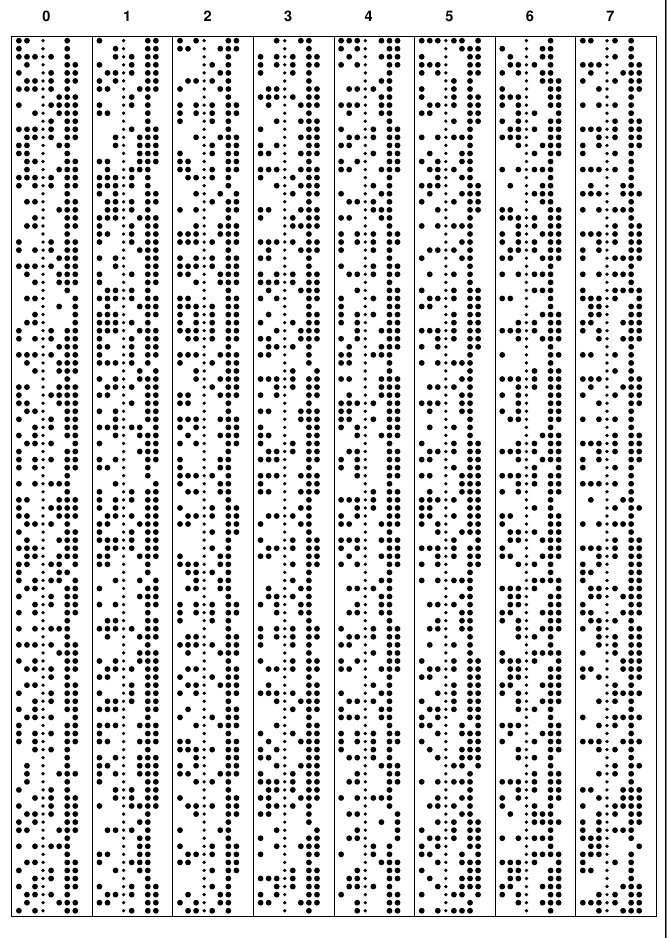

!paper tape to PDF

Anticipating the boards for my paper tape reader PCBs (https://hackaday.com/2022/04/16/paper-tape-reader-self-calibrates-speaks-usb/), I created a python script printing paper pape on paper. 
Still have to cut the paper sheet to inch-wide strips and tape then together.

The firmware promises it can work in reverse mode, so I don't have to build a paper tape punch to test the reader.

The script is based on the FPDF library (http://www.fpdf.org/).

    python3 punch2pdf.py punch2pdf.py

Produces the script in PDF paper tape format.

The script is functional, but not properly refactored. It currently prints 8 bits, no parity. 7-bit with parity might be a cool feature.

The page size is hard coded A4.
